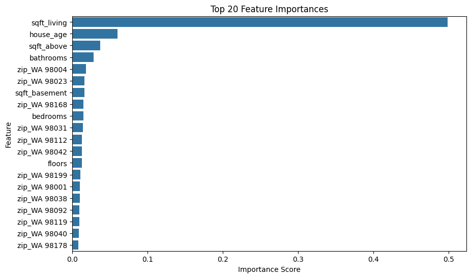

markdown
# Advanced Housing Price Predictor

## Overview
This project uses machine learning to predict housing prices based on multiple features including square footage, number of bedrooms, renovation status, and location. It applies feature engineering, log transformation, and Random Forest regression to improve accuracy and interpretability.

## Dataset
- Source: Kaggle Housing Dataset
- Contains 4,600 entries with features such as:
  - sqft_living, bedrooms, bathrooms, floors
  - yr_built, yr_renovated, zipcode, price
- See `data.csv` for the dataset used in this project

## Feature Engineering
- house_age: Calculated as 2025 minus effective_year, where effective_year is either the renovation year or the original year built
- renovated: Binary feature indicating whether the house was renovated
- log_price: Log-transformed target variable to reduce skew and improve model performance
- statezip: One-hot encoded to capture location-based price variation

## Tools and Libraries
- Python, pandas, numpy, matplotlib, seaborn
- scikit-learn (RandomForestRegressor, train_test_split, cross_val_score)

## Model Performance
- Model: Random Forest Regressor
- RMSE: $232,048
- R² Score: 0.64
- Mean Cross-Validated R² Score: 0.71

## Feature Importance
Top predictors:
- sqft_living
- house_age
- sqft_above
- bathrooms
- Key zip codes (e.g., zip_WA_98004, zip_WA_98023)



## Visualizations
- Scatter plots of actual vs predicted prices
- Bar chart of top 20 feature importances

## Repository Structure
```
housing-price-predictor/
├── Copy_of_Housing_Price_Predictor.ipynb
├── data.csv
├── features-importance.png
└── README.md
```

## Future Improvements
- Hyperparameter tuning with GridSearchCV
- Try XGBoost or LightGBM for better performance
- Add more granular location features such as neighborhood
- Deploy model using Streamlit or Flask
